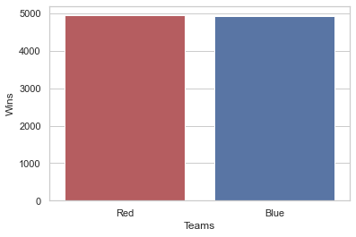
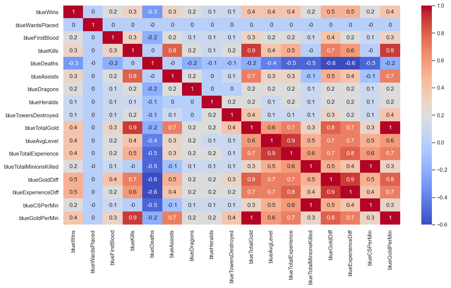
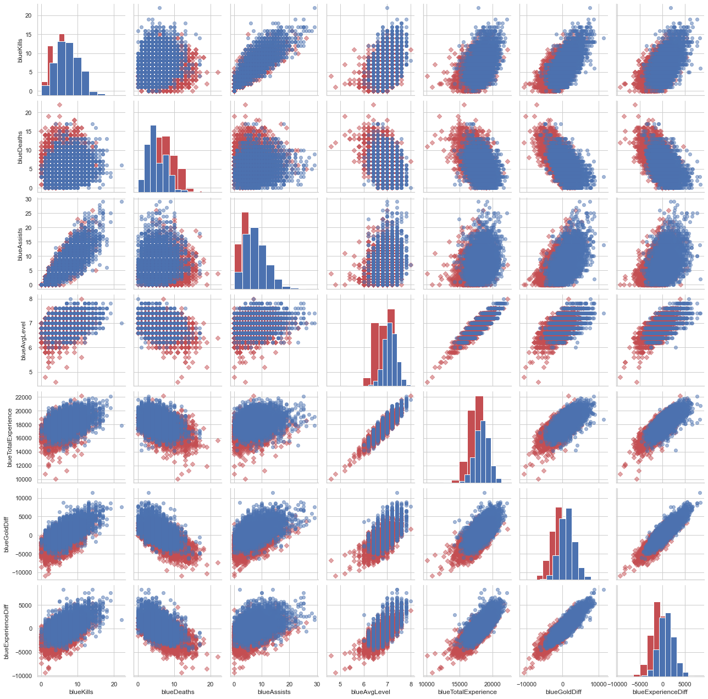
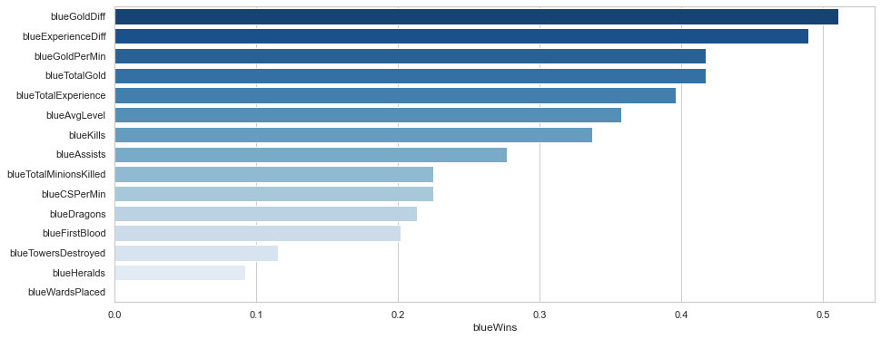

# How to win at League of Legends ?

<br>


<br>

League of Legends is a MOBA that is played in 5 vs 5. The goal of the game is to destroy the main building of the opponent called nexus. To do this you will have to be better than your opponents by gaining a maximum of experiences, golds, kills...

The dataset that I use today comes from about 10000 ranked games of the best Lol players (Diamond 1 to Challenger) which can be found [here](https://www.kaggle.com/bobbyscience/league-of-legends-diamond-ranked-games-10-min). It includes statistics on the 2 teams from 10 min of games and a column indicating which team won the game. The goal of this notebook will be to determine what are the important factors to win a game, so to really know what actions we need to take to get the advantage on yours opponents. The other purpose of this notebook is to try to predict the outcome of a game in advance with its information at 10 mins of play. Let's do that.😀


# 1. Focus on data


```python
#loads packages and the dataset
import pandas as pd
import matplotlib.pyplot as plt
import seaborn as sns
import numpy as np
#ignore warning messages
import warnings
warnings.filterwarnings("ignore")

sns.set(style = "whitegrid")

df = pd.read_csv('high_diamond_ranked_10min.csv')
```


```python
df.head()
```


<div>
<style scoped>
    .dataframe tbody tr th:only-of-type {
        vertical-align: middle;
    }

    .dataframe tbody tr th {
        vertical-align: top;
    }

    .dataframe thead th {
        text-align: right;
    }
</style>
<table border="1" class="dataframe">
  <thead>
    <tr style="text-align: right;">
      <th></th>
      <th>gameId</th>
      <th>blueWins</th>
      <th>blueWardsPlaced</th>
      <th>blueWardsDestroyed</th>
      <th>blueFirstBlood</th>
      <th>blueKills</th>
      <th>blueDeaths</th>
      <th>blueAssists</th>
      <th>blueEliteMonsters</th>
      <th>blueDragons</th>
      <th>...</th>
      <th>redTowersDestroyed</th>
      <th>redTotalGold</th>
      <th>redAvgLevel</th>
      <th>redTotalExperience</th>
      <th>redTotalMinionsKilled</th>
      <th>redTotalJungleMinionsKilled</th>
      <th>redGoldDiff</th>
      <th>redExperienceDiff</th>
      <th>redCSPerMin</th>
      <th>redGoldPerMin</th>
    </tr>
  </thead>
  <tbody>
    <tr>
      <th>0</th>
      <td>4519157822</td>
      <td>0</td>
      <td>28</td>
      <td>2</td>
      <td>1</td>
      <td>9</td>
      <td>6</td>
      <td>11</td>
      <td>0</td>
      <td>0</td>
      <td>...</td>
      <td>0</td>
      <td>16567</td>
      <td>6.8</td>
      <td>17047</td>
      <td>197</td>
      <td>55</td>
      <td>-643</td>
      <td>8</td>
      <td>19.7</td>
      <td>1656.7</td>
    </tr>
    <tr>
      <th>1</th>
      <td>4523371949</td>
      <td>0</td>
      <td>12</td>
      <td>1</td>
      <td>0</td>
      <td>5</td>
      <td>5</td>
      <td>5</td>
      <td>0</td>
      <td>0</td>
      <td>...</td>
      <td>1</td>
      <td>17620</td>
      <td>6.8</td>
      <td>17438</td>
      <td>240</td>
      <td>52</td>
      <td>2908</td>
      <td>1173</td>
      <td>24.0</td>
      <td>1762.0</td>
    </tr>
    <tr>
      <th>2</th>
      <td>4521474530</td>
      <td>0</td>
      <td>15</td>
      <td>0</td>
      <td>0</td>
      <td>7</td>
      <td>11</td>
      <td>4</td>
      <td>1</td>
      <td>1</td>
      <td>...</td>
      <td>0</td>
      <td>17285</td>
      <td>6.8</td>
      <td>17254</td>
      <td>203</td>
      <td>28</td>
      <td>1172</td>
      <td>1033</td>
      <td>20.3</td>
      <td>1728.5</td>
    </tr>
    <tr>
      <th>3</th>
      <td>4524384067</td>
      <td>0</td>
      <td>43</td>
      <td>1</td>
      <td>0</td>
      <td>4</td>
      <td>5</td>
      <td>5</td>
      <td>1</td>
      <td>0</td>
      <td>...</td>
      <td>0</td>
      <td>16478</td>
      <td>7.0</td>
      <td>17961</td>
      <td>235</td>
      <td>47</td>
      <td>1321</td>
      <td>7</td>
      <td>23.5</td>
      <td>1647.8</td>
    </tr>
    <tr>
      <th>4</th>
      <td>4436033771</td>
      <td>0</td>
      <td>75</td>
      <td>4</td>
      <td>0</td>
      <td>6</td>
      <td>6</td>
      <td>6</td>
      <td>0</td>
      <td>0</td>
      <td>...</td>
      <td>0</td>
      <td>17404</td>
      <td>7.0</td>
      <td>18313</td>
      <td>225</td>
      <td>67</td>
      <td>1004</td>
      <td>-230</td>
      <td>22.5</td>
      <td>1740.4</td>
    </tr>
  </tbody>
</table>
<p>5 rows × 40 columns</p>
</div>


## Data Cleaning

Let's start by making sure there is no missing data and removing unnecessary or redundant columns in our dataset.


```python
df.info()
```

    <class 'pandas.core.frame.DataFrame'>
    RangeIndex: 9879 entries, 0 to 9878
    Data columns (total 40 columns):
     #   Column                        Non-Null Count  Dtype  
    ---  ------                        --------------  -----  
     0   gameId                        9879 non-null   int64  
     1   blueWins                      9879 non-null   int64  
     2   blueWardsPlaced               9879 non-null   int64  
     3   blueWardsDestroyed            9879 non-null   int64  
     4   blueFirstBlood                9879 non-null   int64  
     5   blueKills                     9879 non-null   int64  
     6   blueDeaths                    9879 non-null   int64  
     7   blueAssists                   9879 non-null   int64  
     8   blueEliteMonsters             9879 non-null   int64  
     9   blueDragons                   9879 non-null   int64  
     10  blueHeralds                   9879 non-null   int64  
     11  blueTowersDestroyed           9879 non-null   int64  
     12  blueTotalGold                 9879 non-null   int64  
     13  blueAvgLevel                  9879 non-null   float64
     14  blueTotalExperience           9879 non-null   int64  
     15  blueTotalMinionsKilled        9879 non-null   int64  
     16  blueTotalJungleMinionsKilled  9879 non-null   int64  
     17  blueGoldDiff                  9879 non-null   int64  
     18  blueExperienceDiff            9879 non-null   int64  
     19  blueCSPerMin                  9879 non-null   float64
     20  blueGoldPerMin                9879 non-null   float64
     21  redWardsPlaced                9879 non-null   int64  
     22  redWardsDestroyed             9879 non-null   int64  
     23  redFirstBlood                 9879 non-null   int64  
     24  redKills                      9879 non-null   int64  
     25  redDeaths                     9879 non-null   int64  
     26  redAssists                    9879 non-null   int64  
     27  redEliteMonsters              9879 non-null   int64  
     28  redDragons                    9879 non-null   int64  
     29  redHeralds                    9879 non-null   int64  
     30  redTowersDestroyed            9879 non-null   int64  
     31  redTotalGold                  9879 non-null   int64  
     32  redAvgLevel                   9879 non-null   float64
     33  redTotalExperience            9879 non-null   int64  
     34  redTotalMinionsKilled         9879 non-null   int64  
     35  redTotalJungleMinionsKilled   9879 non-null   int64  
     36  redGoldDiff                   9879 non-null   int64  
     37  redExperienceDiff             9879 non-null   int64  
     38  redCSPerMin                   9879 non-null   float64
     39  redGoldPerMin                 9879 non-null   float64
    dtypes: float64(6), int64(34)
    memory usage: 3.0 MB
    

Looks like there's no missing data.

Since we want to know how to win a game and we want to know what actions will allow us to gain an advantage over the opposing team, we will only focus on how to win from a team perspective. Thus, we will remove all the columns of the red team. Also based on my experience of the game, I allow myself to remove columns that don't really impact the game.


```python
#dropping useless or redondant columns
df_clean = df.drop(columns = ["gameId", "blueWardsDestroyed", "blueTotalJungleMinionsKilled", "blueEliteMonsters",
                              "redWardsPlaced", "redWardsDestroyed","redFirstBlood", "redKills", "redDeaths",
                              "redAssists", "redEliteMonsters", "redDragons", "redHeralds", "redTowersDestroyed",
                              "redTotalGold", "redAvgLevel", "redTotalExperience", "redTotalMinionsKilled",
                              "redTotalMinionsKilled", "redTotalMinionsKilled", "redExperienceDiff", "redCSPerMin", 
                              "redGoldPerMin", "redTotalJungleMinionsKilled", "redGoldDiff"])
```


```python
df_clean.head()
```


<div>
<style scoped>
    .dataframe tbody tr th:only-of-type {
        vertical-align: middle;
    }

    .dataframe tbody tr th {
        vertical-align: top;
    }

    .dataframe thead th {
        text-align: right;
    }
</style>
<table border="1" class="dataframe">
  <thead>
    <tr style="text-align: right;">
      <th></th>
      <th>blueWins</th>
      <th>blueWardsPlaced</th>
      <th>blueFirstBlood</th>
      <th>blueKills</th>
      <th>blueDeaths</th>
      <th>blueAssists</th>
      <th>blueDragons</th>
      <th>blueHeralds</th>
      <th>blueTowersDestroyed</th>
      <th>blueTotalGold</th>
      <th>blueAvgLevel</th>
      <th>blueTotalExperience</th>
      <th>blueTotalMinionsKilled</th>
      <th>blueGoldDiff</th>
      <th>blueExperienceDiff</th>
      <th>blueCSPerMin</th>
      <th>blueGoldPerMin</th>
    </tr>
  </thead>
  <tbody>
    <tr>
      <th>0</th>
      <td>0</td>
      <td>28</td>
      <td>1</td>
      <td>9</td>
      <td>6</td>
      <td>11</td>
      <td>0</td>
      <td>0</td>
      <td>0</td>
      <td>17210</td>
      <td>6.6</td>
      <td>17039</td>
      <td>195</td>
      <td>643</td>
      <td>-8</td>
      <td>19.5</td>
      <td>1721.0</td>
    </tr>
    <tr>
      <th>1</th>
      <td>0</td>
      <td>12</td>
      <td>0</td>
      <td>5</td>
      <td>5</td>
      <td>5</td>
      <td>0</td>
      <td>0</td>
      <td>0</td>
      <td>14712</td>
      <td>6.6</td>
      <td>16265</td>
      <td>174</td>
      <td>-2908</td>
      <td>-1173</td>
      <td>17.4</td>
      <td>1471.2</td>
    </tr>
    <tr>
      <th>2</th>
      <td>0</td>
      <td>15</td>
      <td>0</td>
      <td>7</td>
      <td>11</td>
      <td>4</td>
      <td>1</td>
      <td>0</td>
      <td>0</td>
      <td>16113</td>
      <td>6.4</td>
      <td>16221</td>
      <td>186</td>
      <td>-1172</td>
      <td>-1033</td>
      <td>18.6</td>
      <td>1611.3</td>
    </tr>
    <tr>
      <th>3</th>
      <td>0</td>
      <td>43</td>
      <td>0</td>
      <td>4</td>
      <td>5</td>
      <td>5</td>
      <td>0</td>
      <td>1</td>
      <td>0</td>
      <td>15157</td>
      <td>7.0</td>
      <td>17954</td>
      <td>201</td>
      <td>-1321</td>
      <td>-7</td>
      <td>20.1</td>
      <td>1515.7</td>
    </tr>
    <tr>
      <th>4</th>
      <td>0</td>
      <td>75</td>
      <td>0</td>
      <td>6</td>
      <td>6</td>
      <td>6</td>
      <td>0</td>
      <td>0</td>
      <td>0</td>
      <td>16400</td>
      <td>7.0</td>
      <td>18543</td>
      <td>210</td>
      <td>-1004</td>
      <td>230</td>
      <td>21.0</td>
      <td>1640.0</td>
    </tr>
  </tbody>
</table>
</div>


## Data analysis


```python
#plotting number of wins for each teams
sns.countplot(x = df.blueWins, palette = sns.color_palette(['r','b']))
plt.xticks([0,1], ['Red','Blue'])
plt.xlabel('Teams')
plt.ylabel('Wins')
```


    Text(0, 0.5, 'Wins')





The number of wins is similar on either side.

Let's see now what are the correlations between the variables :


```python
#create the correlation matrix
corr_mat = df_clean.corr()
#changing the figure size
f, ax = plt.subplots(figsize=(15, 8))
corr_mat = corr_mat.round(1)
sns.heatmap(corr_mat, annot = True, cmap = 'coolwarm')
```


    <matplotlib.axes._subplots.AxesSubplot at 0x259b6d302b0>





We can all see right away that the wards put down have little or no impact in the decision of the game. On the contrary, golds and experience are the priorities to take the advantage over the enemy team. We can notice that the only variable with a negative coefficient on the impact of the victory is the team's deaths.

Now let's look at the different interactions between the variables:


```python
#plotting pairgrid of the principal variables
g = sns.PairGrid(data = df_clean, 
                 vars = ['blueKills', 'blueDeaths', 'blueAssists',
                       'blueAvgLevel', 'blueTotalExperience','blueGoldDiff',
                       'blueExperienceDiff'],
                 hue = 'blueWins',
                 palette = sns.color_palette(['r', 'b']),
                 hue_kws = {"marker": ["D", "o"], "alpha": [0.5, 0.5]})

g.map_diag(plt.hist)
g.map_offdiag(plt.scatter)
```


    <seaborn.axisgrid.PairGrid at 0x259b797d7f0>





Here too we can notice some interesting interactions. For example, it seems that the difference between gold and experience is linearly correlated, or that there is a huge difference in experience between a team's victories and defeats.

Here are the most influential variables in a team's win/loss:


```python
plt.figure(figsize = (15,6))
dfw = df_clean.corr()['blueWins'].drop(['blueWins', 'blueDeaths'])
dfw = dfw.sort_values(ascending=False)

pal = sns.color_palette("Blues_r", len(dfw))
rank = dfw.argsort().argsort() 

sns.barplot(y = dfw.index, x = dfw, palette = np.array(pal[::-1])[rank])
```


    <matplotlib.axes._subplots.AxesSubplot at 0x259b9ed2e50>





You can see that accumulating a maximum amount of gold is the key to the game. Then, we find the experience which is placed in 2nd position. 

## Conlcusion

We have therefore seen in this first part the different relationships between the data and how they affect victories and defeats. But to sum up, how do we win?

* Winning golds is the most important task, more important than kills.
* Passing levels is also more important than kills.
* The wards are afraid to see no impact on the game.
* The first blood is relatively important.
* Destroying towers and heralds is not very important.

# 2. Forecasting game results

## Model testing


```python
from sklearn.model_selection import train_test_split

# train test split
x = df_clean.drop('blueWins', axis=1)
y = df_clean['blueWins']

x_train,x_test,y_train,y_test = train_test_split(x,y,test_size=0.2,random_state=15)
```

## SVC


```python
#Import SVC
from sklearn.svm import SVC
#Accuracy metric
from sklearn.metrics import accuracy_score

svc = SVC()
#Train the model
svc.fit(x_train,y_train)
#Predict test data
pred_scv = svc.predict(x_test)

#Accuracy of SVC
acc_svc = accuracy_score(pred_scv, y_test)
print("SVC Accuracy : {}".format(acc_svc))
```

    SVC Accuracy : 0.7252024291497976
    

## Linear SVC


```python
#Import Linear SVC
from sklearn.svm import LinearSVC

lsvc = LinearSVC(max_iter = 12000, dual = True)
#Train the model
lsvc.fit(x_train, y_train)
#Predict test data
pred_lsvc = lsvc.predict(x_test)

#Accuracy of Linear SVC
acc_lsvc = accuracy_score(pred_lsvc, y_test)
print("Linear SVC Accuracy : {}".format(acc_lsvc))
```

    Linear SVC Accuracy : 0.6093117408906883
    

## Naive Bayes


```python
#Import Naive Bayes
from sklearn.naive_bayes import GaussianNB

nb = GaussianNB()
#Train the model
nb.fit(x_train, y_train)
#Predict test data
pred_nb = nb.predict(x_test)

#Accuracy of Naive Bayes
acc_nb = accuracy_score(pred_nb, y_test)
print("Naive Bayes Accuracy : {}".format(acc_nb))
```

    Naive Bayes Accuracy : 0.7090080971659919
    

## SGD


```python
#Import Stochastic Gradient Decent
from sklearn.linear_model import SGDClassifier

sgd = SGDClassifier()
#Train the model
sgd.fit(x_train, y_train)
#Predict test data
pred_sgd = sgd.predict(x_test)

#Accuracy of SDG
acc_sgd = accuracy_score(pred_sgd, y_test)
print("SGD Accuracy : {}".format(acc_sgd))
```

    SGD Accuracy : 0.6604251012145749
    

## K-Nearest Neighbors


```python
#Import K-Nearest Neighbors
from sklearn.neighbors import KNeighborsClassifier

knn = KNeighborsClassifier()
#Train the model
knn.fit(x_train, y_train)
#Predict test data
pred_knn = knn.predict(x_test)

#Accuracy of KNN
acc_knn = accuracy_score(pred_knn, y_test)
print("KNN Accuracy : {}".format(acc_knn))
```

    KNN Accuracy : 0.708502024291498
    

## Decision Tree


```python
#Import Decision Tree
from sklearn.tree import DecisionTreeClassifier

dt = DecisionTreeClassifier()
#Train the model
dt.fit(x_train, y_train)
#Predict test data
pred_dt = dc.predict(x_test)

#Accuracy of Decision Tree
acc_dt = accuracy_score(pred_dc, y_test)
print("Decision Tree Accuracy : {}".format(acc_dt))
```

    Decision Tree Accuracy : 0.6219635627530364
    

## Random Forest


```python
#Import Random Forest
from sklearn.ensemble import RandomForestClassifier

rf = RandomForestClassifier()
#Train the model
rf.fit(x_train, y_train)
#Predict test data
pred_rf = rf.predict(x_test)

#Accuracy of Random Forest
acc_rf = accuracy_score(pred_rf, y_test)
print("Random Forest Accuracy : {}".format(acc_rf))
```

    Random Forest Accuracy : 0.7206477732793523
    

## Logistic Regression


```python
#Import Logistic Regression
from sklearn.linear_model import LogisticRegression

lr = LogisticRegression()
#Train the model
lr.fit(x_train, y_train)
#Predict test data
pred_lr = lr.predict(x_test)

#Accuracy of Logistic Regression
acc_lr = accuracy_score(pred_lr, y_test)
print("Logistic Regression Accuracy : {}".format(acc_lr))
```

    Logistic Regression Accuracy : 0.7267206477732794
    

# Results


```python
#Create a dict to save the scores
acc_dict = {'SVC' : [acc_svc] , 'Linear SVC' : [acc_lsvc] , 
            'Naive Bayes' : [acc_nb], 'SGD' : [acc_sgd],
            'KNN' : [acc_knn], 'Decison Tree': [acc_dt],
            'Random Forest' : [acc_rf], 'Logistic Regression': [acc_lr]}

#Dict to a DataFrame
df_acc = pd.DataFrame.from_dict(acc_dict,orient= 'index',
                                columns = ['Accuracy'])
#Sort the values
df_acc.sort_values(by = ['Accuracy'], inplace = True, ascending = False)
print(df_acc)
```

                         Accuracy
    Logistic Regression  0.726721
    SVC                  0.725202
    Random Forest        0.720648
    Naive Bayes          0.709008
    KNN                  0.708502
    SGD                  0.660425
    Decison Tree         0.621964
    Linear SVC           0.609312
    

It can therefore be observed that the best performing model here is Logistic Regression with an Accuracy of almost 73%. This is still relatively low. Now let's see what are the decisive variables in this model:


```python
#Coeft of the differents variables
print(lr.coef_)
```

    [[-1.64442006e-03  7.31350216e-05  1.12710358e-05 -1.95041670e-04
       8.61218723e-05  4.22646239e-04  2.07749071e-05 -2.35337518e-05
       8.67984921e-06 -5.86804237e-06  2.03358659e-05 -2.14923760e-03
       4.13286572e-04  2.46519442e-04 -2.14923760e-04  8.67984921e-07]]
    


```python
#Odd Ratio of the variables
np.exp(lr.coef_)
```


    array([[0.99835693, 1.00007314, 1.00001127, 0.99980498, 1.00008613,
            1.00042274, 1.00002078, 0.99997647, 1.00000868, 0.99999413,
            1.00002034, 0.99785307, 1.00041337, 1.00024655, 0.9997851 ,
            1.00000087]])


```python
df_clean.drop(['blueWins'], axis=1, inplace = True)

coef_data = np.concatenate((np.abs(lr.coef_), np.exp(lr.coef_)),axis = 0)
coef_df = pd.DataFrame(data = coef_data, columns = df_clean.columns).T.reset_index().rename(columns = {'index' : 'Variables', 0: 'Coef', 1 : 'Odd Ration'})
coef_df.sort_values(by = 'Coef', ascending = False)
```


<div>
<style scoped>
    .dataframe tbody tr th:only-of-type {
        vertical-align: middle;
    }

    .dataframe tbody tr th {
        vertical-align: top;
    }

    .dataframe thead th {
        text-align: right;
    }
</style>
<table border="1" class="dataframe">
  <thead>
    <tr style="text-align: right;">
      <th></th>
      <th>Variables</th>
      <th>Coef</th>
      <th>Odd Ration</th>
    </tr>
  </thead>
  <tbody>
    <tr>
      <th>11</th>
      <td>blueTotalMinionsKilled</td>
      <td>2.149238e-03</td>
      <td>0.997853</td>
    </tr>
    <tr>
      <th>0</th>
      <td>blueWardsPlaced</td>
      <td>1.644420e-03</td>
      <td>0.998357</td>
    </tr>
    <tr>
      <th>5</th>
      <td>blueDragons</td>
      <td>4.226462e-04</td>
      <td>1.000423</td>
    </tr>
    <tr>
      <th>12</th>
      <td>blueGoldDiff</td>
      <td>4.132866e-04</td>
      <td>1.000413</td>
    </tr>
    <tr>
      <th>13</th>
      <td>blueExperienceDiff</td>
      <td>2.465194e-04</td>
      <td>1.000247</td>
    </tr>
    <tr>
      <th>14</th>
      <td>blueCSPerMin</td>
      <td>2.149238e-04</td>
      <td>0.999785</td>
    </tr>
    <tr>
      <th>3</th>
      <td>blueDeaths</td>
      <td>1.950417e-04</td>
      <td>0.999805</td>
    </tr>
    <tr>
      <th>4</th>
      <td>blueAssists</td>
      <td>8.612187e-05</td>
      <td>1.000086</td>
    </tr>
    <tr>
      <th>1</th>
      <td>blueFirstBlood</td>
      <td>7.313502e-05</td>
      <td>1.000073</td>
    </tr>
    <tr>
      <th>7</th>
      <td>blueTowersDestroyed</td>
      <td>2.353375e-05</td>
      <td>0.999976</td>
    </tr>
    <tr>
      <th>6</th>
      <td>blueHeralds</td>
      <td>2.077491e-05</td>
      <td>1.000021</td>
    </tr>
    <tr>
      <th>10</th>
      <td>blueTotalExperience</td>
      <td>2.033587e-05</td>
      <td>1.000020</td>
    </tr>
    <tr>
      <th>2</th>
      <td>blueKills</td>
      <td>1.127104e-05</td>
      <td>1.000011</td>
    </tr>
    <tr>
      <th>8</th>
      <td>blueTotalGold</td>
      <td>8.679849e-06</td>
      <td>1.000009</td>
    </tr>
    <tr>
      <th>9</th>
      <td>blueAvgLevel</td>
      <td>5.868042e-06</td>
      <td>0.999994</td>
    </tr>
    <tr>
      <th>15</th>
      <td>blueGoldPerMin</td>
      <td>8.679849e-07</td>
      <td>1.000001</td>
    </tr>
  </tbody>
</table>
</div>


We notice that the important variables we have previously observed in the first part are not the same as the one the model uses to predict the outcome of a game. Here for example, the variables with the most weight are the total number of Minions killed by the team and the number of ward placed.

# Conclusion

As a conclusion, we can now know exactly which actions are essential to focus on in order to win a League of Legends game. We also managed to train a model that predicts the outcome of a game within 10 minutes of play with an accuracy of almost 73%. However, this result is still quite low. This is probably due to the fact that some important information is missing in the dataset (such as the champions played by the players). It should not be forgotten also that the dataset is based only on the best players in the game. The impact you can have on a share game if you play well or not is not taken into account at all here.

Thank you for your reading 😀


```python

```
